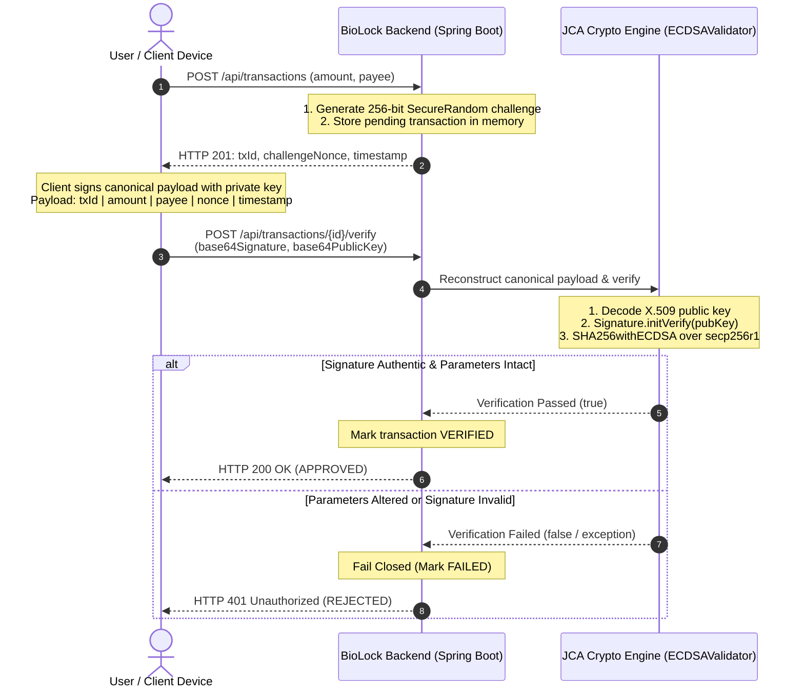

# BioLock

### Transaction Authorization Backend

> *"Bind the authorization to the transaction — not just the user."*

[](https://openjdk.org/)
[](https://spring.io/projects/spring-boot)
[](https://docs.oracle.com/en/java/javase/17/security/java-cryptography-architecture-jca-reference-guide.html)
[](LICENSE)
[](https://biolock-28kv.onrender.com/api/demo/run)

BioLock is a backend transaction authorization service written in **Java 17** and **Spring Boot 3.2.2**. It enforces asymmetric ECDSA signature verification over the **NIST P-256 (`secp256r1`)** elliptic curve using the standard **Java Cryptography Architecture (JCA)**.

By binding every cryptographic signature to an immutable, canonical transaction payload, BioLock ensures that in-flight alterations to transaction parameters (such as amount or payee) invalidate the signature mathematically at the verification layer.

**Live Interactive Demo:** [https://biolock-28kv.onrender.com/api/demo/run](https://biolock-28kv.onrender.com/api/demo/run)

---

## The Engineering Problem

Traditional payment authentication often relies on shared secrets, session tokens, or one-time passcodes (OTPs). While these authenticate the identity of the user, they do not inherently guarantee the integrity of the transaction parameters being processed:

1. **User Authentication vs. Transaction Integrity:** Authenticating a user only proves who initiated a session; it does not bind their intent to a specific monetary amount or destination account.
2. **In-Flight Parameter Manipulation:** In man-in-the-middle or compromised client environments, transaction attributes (e.g., modifying `INR 2,500` to `INR 25,000` or replacing a merchant payee with an attacker's account) can occur between initial user authentication and server authorization.
3. **Replay Vulnerabilities:** Re-submitting an intercepted authorization payload can lead to duplicate settlements if challenges are not strictly single-use and bound to time.

### The BioLock Approach

BioLock treats every transaction as a cryptographically bounded contract:
* The client signs a **deterministic canonical payload** containing the transaction ID, exact amount, payee identifier, cryptographic challenge nonce, and timestamp.
* The backend independently reconstructs the identical canonical byte sequence from authoritative server state and validates the ECDSA signature via JCA.
* Any parameter alteration changes the canonical byte payload, causing verification to fail closed.

---

## Architecture & Verification Flow



---

## Canonical Payload Binding

To prevent parameter tampering, the signed byte array must follow a strict, deterministic serialization order. In [`ECDSAValidator.java`](src/main/java/com/scamshield/biolock/security/ECDSAValidator.java), the canonical payload is constructed as:

```java
public byte[] buildCanonicalPayload(
        String transactionId, 
        Double amount, 
        String payeeUpi, 
        String challengeNonce, 
        Long timestamp) {
    if (transactionId == null || amount == null || payeeUpi == null || challengeNonce == null || timestamp == null) {
        throw new IllegalArgumentException("Payload attributes must not be null");
    }
    // Deterministic pipe-delimited format with fixed decimal precision
    String canonical = String.format("%s|%.2f|%s|%s|%d", 
            transactionId, amount, payeeUpi, challengeNonce, timestamp);
    return canonical.getBytes(StandardCharsets.UTF_8);
}
```

Because the signature is computed over this exact byte stream:
* Altering the amount by even 1 cent changes the input digest to `SHA256withECDSA`.
* Changing the payee account changes the canonical payload, so the existing signature no longer verifies against that payload.
* Altering or substituting the challenge nonce results in instant mathematical rejection.

---

## Live API Demonstration

The deployed service hosts an interactive demonstration endpoint that executes three real cryptographic verification scenarios in sequence:

**Endpoint:** `GET https://biolock-28kv.onrender.com/api/demo/run`

### Verified Scenarios:
1. **Scenario A (Authentic Transfer):** A simulated client signs the canonical payload with its EC private key. Verification succeeds with zero tampering.
2. **Scenario B (Amount Tampering Attack):** The transaction amount is modified in flight from `INR 2500.00` to `INR 25000.00`. Verification is rejected mathematically.
3. **Scenario C (Payee Redirection Attack):** The payee is redirected from `merchant.swiggy@icici` to `hacker.scam@okaxis`. Signature verification fails closed.

<details>
<summary><b>Click to view representative JSON response from <code>/api/demo/run</code></b></summary>

```json
{
  "engine": "BioLock Transaction Authorization Backend",
  "curve": "secp256r1 (NIST P-256 ECDSA)",
  "verification": "Fail-Closed ECDSA Verification Engine",
  "scenario_authentic_transfer": {
    "description": "Authentic Transaction Signed with Client EC Private Key",
    "transactionId": "TX-1641A71F",
    "authorizedAmount": "INR 2500.00",
    "payee": "merchant.swiggy@icici",
    "signature": "MEQCIGs9k4rV74D1qg2sH...",
    "verificationLatencyMs": 1.125,
    "status": "APPROVED",
    "verdict": "Cryptographic signature matches canonical payload. Zero tampering detected."
  },
  "scenario_in_flight_tampering_attack": {
    "description": "In-Flight Parameter Tampering (Amount Modified)",
    "originalAmount": "INR 2500.00",
    "interceptedTamperedAmount": "INR 25000.00",
    "verificationLatencyMs": 0.842,
    "status": "BLOCKED_TAMPER_DETECTED",
    "verdict": "Signature mathematically failed over tampered payload. Transaction dropped."
  },
  "scenario_payee_tampering_attack": {
    "description": "In-Flight Parameter Tampering (Payee Modified)",
    "authorizedPayee": "merchant.swiggy@icici",
    "interceptedPayee": "hacker.scam@okaxis",
    "verificationLatencyMs": 0.795,
    "status": "BLOCKED_PAYEE_TAMPER_DETECTED",
    "verdict": "Signature rejected: Payee was altered from legitimate merchant to unauthorized account."
  }
}
```
</details>

---

## Cryptographic Implementation Details

BioLock relies solely on standard Java SE security facilities without third-party cryptographic wrappers:

* **Curve & Algorithm:** Uses `secp256r1` (NIST P-256) initialized via `ECGenParameterSpec("secp256r1")` with `SHA256withECDSA`.
* **Public Key Decoding:** Reconstructs client-supplied public keys from Base64-encoded X.509 byte sequences using `KeyFactory.getInstance("EC")` and `X509EncodedKeySpec`.
* **Stateless Verification:** The [`ECDSAValidator`](src/main/java/com/scamshield/biolock/security/ECDSAValidator.java) component holds no mutable instance state, allowing concurrent requests to be verified safely across thread pools.
* **Fail-Closed Security:** Malformed Base64, decoding errors, or cryptographic verification exceptions are caught and explicitly return `false` rather than leaking internal traces.

```java
public boolean verifySignature(byte[] canonicalPayload, String base64Signature, PublicKey publicKey) {
    if (canonicalPayload == null || base64Signature == null || publicKey == null) {
        return false;
    }
    try {
        byte[] signatureBytes = Base64.getDecoder().decode(base64Signature);
        Signature signature = Signature.getInstance("SHA256withECDSA");
        signature.initVerify(publicKey);
        signature.update(canonicalPayload);
        return signature.verify(signatureBytes);
    } catch (Exception e) {
        // Fails closed on any formatting, parsing, or signature anomaly
        return false;
    }
}
```

---

## Current Implementation vs. Production Direction

To maintain absolute architectural transparency, the distinction between the current reference implementation and production requirements is documented below:

| Dimension | Current Reference Implementation | Production Architecture Roadmap |
| :--- | :--- | :--- |
| **Challenge Storage** | In-memory `ConcurrentHashMap<String, Transaction>` in [`TransactionService`](src/main/java/com/scamshield/biolock/service/TransactionService.java). | Distributed **Redis** cluster with atomic single-use invalidation (`GETDEL` / Lua script). |
| **Replay / Single-Use** | Enforces single-attempt state transitions (`PENDING` $\rightarrow$ `VERIFIED`/`FAILED`); re-verifications fail. | Strict Redis key TTL (e.g., 10-second automatic eviction) preventing replay indefinitely. |
| **Deployment** | Single-instance container on Render (OpenJDK 17). | Multi-instance deployment behind a load balancer with stateless verification. |
| **Persistence** | Volatile in-memory mock for development and demo isolation. | Relational database (PostgreSQL) for immutable audit trails and settlement events. |
| **Benchmarking** | Sequential 100-iteration micro-timing test measuring local JCA baseline latency. | Isolated JMH (Java Microbenchmark Harness) multi-threaded concurrency benchmarks. |

---

## Test Suite & Verification

The test suite in [`BioLockCryptoTest.java`](src/test/java/com/scamshield/biolock/security/BioLockCryptoTest.java) runs automated unit tests covering the core security constraints:

1. **`testAuthenticTransactionVerification`:** Verifies that an authentic NIST P-256 signature generated over a canonical payload validates successfully (`assertTrue`).
2. **`testTamperedAmountRejection`:** Verifies that modifying the authorized amount from `2500.00` to `25000.00` causes mathematical signature verification to fail (`assertFalse`).
3. **`testSequentialVerificationMicroTiming`:** Executes 100 sequential verification iterations in a tight test loop, measuring baseline JCA verification execution time on the local CPU (consistently averaging ~1.0–1.8 ms per verification).

Run tests locally:
```bash
./mvnw clean test
```

---

## Quick Start & Local Execution

### Prerequisites
* Java Development Kit (JDK) 17 or higher
* Git

### Build and Run
```bash
# 1. Clone repository
git clone https://github.com/ishcares/Biolock.git
cd Biolock

# 2. Execute test suite
./mvnw clean test

# 3. Launch application locally
./mvnw spring-boot:run
```

Once running, access the local service:
* Health check: `http://localhost:8080/health`
* Live scenario test: `http://localhost:8080/api/demo/run`

---

## Engineering Roadmap

Planned future technical improvements include:
* [ ] **Distributed Challenge Store:** Replace the in-memory map with Redis integration using `spring-boot-starter-data-redis` and atomic single-use TTL invalidation.
* [ ] **Testcontainers Integration:** Add integration tests with Testcontainers to validate Redis connection lifecycle and cluster failover behavior.
* [ ] **JMH Microbenchmarking Suite:** Add an isolated Java Microbenchmark Harness (JMH) suite to defensibly measure JCA throughput and latency under multi-threaded concurrency.
* [ ] **WebAuthn Attestation Parser:** Incorporate client-data-JSON and authenticator-data verification to directly parse browser and mobile FIDO2/WebAuthn assertion payloads.

---

## License

This project is open-source and available under the [MIT License](LICENSE).
